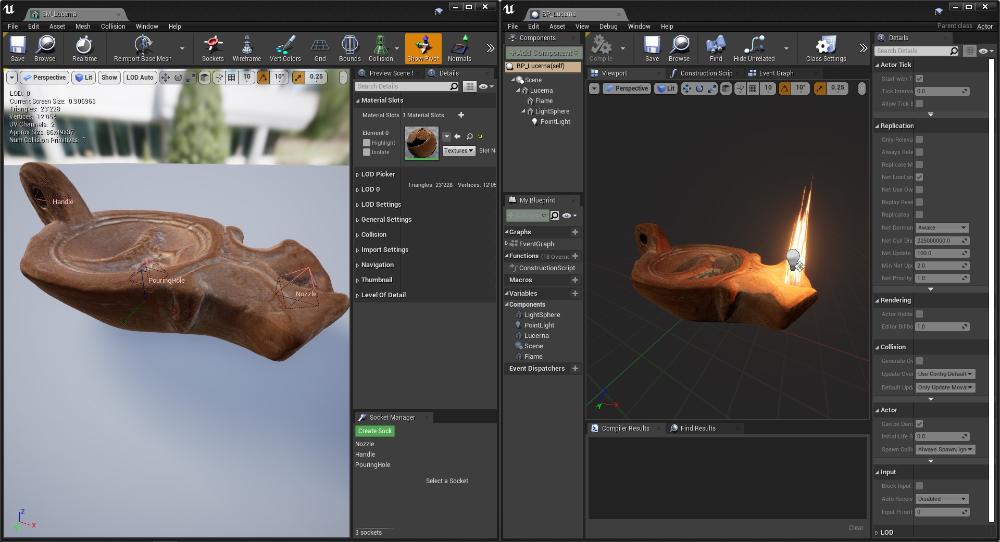

# Unreal Engine Plug-in: Cultural Heritage &ndash; README

Plug-in Version: 1.0.0
 Author: Roland Bruggmann aka [brugr9](https://www.unrealengine.com/marketplace/en-US/profile/brugr9) (UE Marketplace)
 Licence: [Creative Commons Attribution 4.0 International (CC BY 4.0)](http://creativecommons.org/licenses/by/4.0/)

## Description

Replica of a Roman oil lamp from Archaeological Museum of Jerez.

## Technical Information

Features:

* Blueprint of Replica "Lucerna Romana"

Number of Blueprints: 1

Documentation:

* README: [https://github.com/brugr9/UEPluginCulturalHeritage/](https://github.com/brugr9/UEPluginCulturalHeritage/)

## Tags

Cultural Heritage, Roman

---

# Documentation

Screenshot of static mesh 'SM_Lucerna' and Blueprint 'BP_Lucerna':

# Attribution

* ["Réplica de lucerna romana - Museo de Jerez"](https://skfb.ly/6T7sx) by pabz_arqueologia is licensed under [Creative Commons Attribution](http://creativecommons.org/licenses/by/4.0/).
