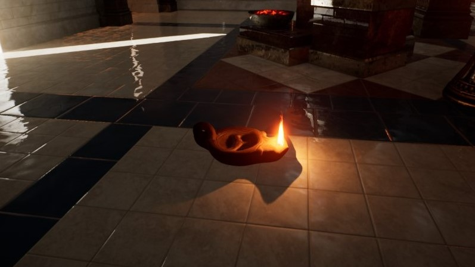

# Unreal Engine Plug-in: Cultural Heritage &ndash; README

Plug-in Version: 1.0.0
 Author: Roland Bruggmann

## Description

Replica of a Roman oil lamp from Archaeological Museum of Jerez.

## Technical Information

Features:

* Blueprint of Replica "Lucerna Romana"

Number of Blueprints: 1

Documentation:

* README: [https://github.com/brugr9/UEPluginCulturalHeritage/](https://github.com/brugr9/UEPluginCulturalHeritage/)

## Tags

Cultural Heritage, Roman

---

# Documentation

Screenshot of static mesh 'SM_Lucerna' and Blueprint 'BP_Lucerna':

# Source

* Museo Arqueológico Municipal de Jerez de la Frontera: [*Réplica de Lucerna Romana*](https://sketchfab.com/3d-models/replica-de-lucerna-romana-museo-de-jerez-39a640dba68a413a9cc10338fa69ff2e) on Sketchfab
* [Attribution 4.0 International (CC BY 4.0)](https://creativecommons.org/licenses/by/4.0/) &ndash; no changes were made neither to the mesh nore to the textures
